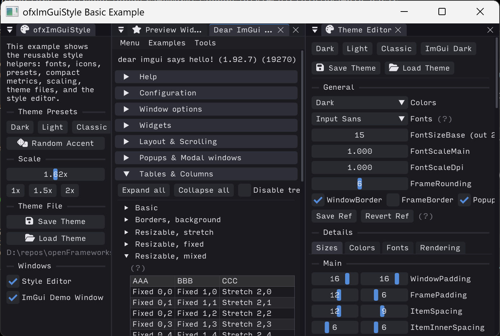

# ofxImGuiStyle



`ofxImGuiStyle` is a small companion addon for `ofxImGui` that centralizes
shared ImGui styling for openFrameworks apps.

It provides:

- bundled Input Sans font loading
- bundled Font Awesome 5 Solid icon merging
- reusable dark, light, and classic theme helpers
- compact scrollbar/grab metrics for HiDPI screens
- random accent-theme generation
- base-style capture and UI scale application
- binary `ImGuiStyle` save/load helpers
- a simple built-in style editor window

The addon is intentionally generic. Higher-level editor addons, such as
`ofxKit`, should own their menus, preferences, and persistence policy while
delegating reusable font/theme/style mechanics to `ofxImGuiStyle`.

## Usage

Add both addons to `addons.make`:

```make
ofxImGui
ofxImGuiStyle
```

Then load fonts after `ofxImGui::Gui::setup()` and before drawing the first
frame:

```cpp
#include "ofxImGui.h"
#include "ofxImGuiStyle.h"

ofxImGui::Gui gui;
ofxImGuiStyle style;

void ofApp::setup() {
    gui.setup();

    style.loadFonts(gui, 15.0f);
    ofxImGuiStyle::applyDarkTheme();
    style.captureBaseStyle();
}

void ofApp::draw() {
    gui.begin();

    if (ImGui::Button("Random Theme")) {
        ofxImGuiStyle::applyRandomAccentTheme();
        style.captureBaseStyle();
    }

    gui.end();
}
```

## Scaling

Use `captureBaseStyle()` after applying a theme, then call `applyScale()` when
the UI scale changes. This avoids compounding paddings and margins every time
the scale or theme changes.

```cpp
ofxImGuiStyle::applyDarkTheme();
style.captureBaseStyle();

style.applyScale(1.5f);
```

## Theme Files

Themes are saved as binary snapshots of `ImGuiStyle`.

```cpp
ofxImGuiStyle::saveTheme(ofToDataPath("theme.bin", true));

if (ofxImGuiStyle::loadTheme(ofToDataPath("theme.bin", true))) {
    ofxImGuiStyle::applyCompactMetrics();
    style.captureBaseStyle();
}
```

## Examples

- `example_Basic` demonstrates the focused API surface: fonts, icons, presets,
  random accent themes, scaling, save/load, and the style editor.
- `example_LumaStudio` is a larger fictional app mockup showing what a styled
  ImGui application can feel like.
